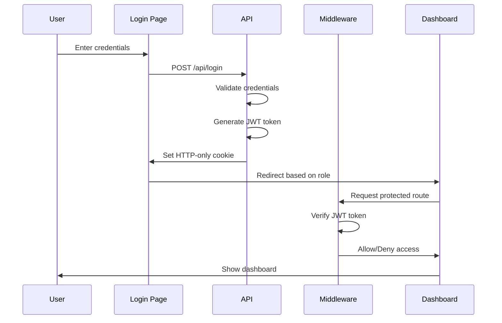

# Role-Based JWT Authentication in Next.js

A complete authentication system built with **Next.js 14**, **TypeScript**, **TailwindCSS**, and **JWT** tokens. This project demonstrates secure user authentication with role-based access control without using any external database.

[](https://nextjs.org/)
[](https://www.typescriptlang.org/)
[](https://tailwindcss.com/)
[](https://jwt.io/)

---

## ✨ Features

- 🔐 **JWT-based Authentication** - Secure token-based auth
- 👥 **Role-Based Access Control** - Admin and User roles
- 🍪 **HTTP-only Cookies** - Secure token storage
- 🛡️ **Middleware Protection** - Server-side route protection
- 🎨 **Beautiful UI** - Modern design with TailwindCSS
- 📱 **Fully Responsive** - Works on all devices
- ⚡ **No Database Required** - Hardcoded users for demo purposes
- 🔒 **Secure by Default** - Best security practices implemented

---

## 🚀 Demo Credentials

### Admin Account
- **Username:** `admin`
- **Password:** `admin123`
- **Access:** `/admin/dashboard`

### User Account
- **Username:** `john`
- **Password:** `user123`
- **Access:** `/user/dashboard`

---

## 📋 Prerequisites

Before you begin, ensure you have the following installed:

- **Node.js** (v18 or higher)
- **npm** or **yarn** or **pnpm**
- A code editor (VS Code recommended)

---

## 🛠️ Installation

### 1. Clone the Repository

```bash
git clone https://github.com/JD-Ashish-3/interntask1.git
cd interntask1
```

### 2. Install Dependencies

```bash
npm install
```

### 3. Create Environment Variables

Create a `.env.local` file in the root directory:

```env
JWT_SECRET=your_super_secret_key_change_this_in_production
```

⚠️ **Important:** Use a strong, random secret key in production!

### 4. Run Development Server

```bash
npm run dev
```

Open [http://localhost:3000](http://localhost:3000) in your browser.

---

## 📁 Project Structure

```
nextjs-auth-app/
├── app/
│   ├── api/
│   │   ├── login/
│   │   │   └── route.ts          # Login API endpoint
│   │   └── logout/
│   │       └── route.ts          # Logout API endpoint
│   ├── admin/
│   │   └── dashboard/
│   │       └── page.tsx          # Admin dashboard (protected)
│   ├── user/
│   │   └── dashboard/
│   │       └── page.tsx          # User dashboard (protected)
│   ├── login/
│   │   └── page.tsx              # Login page
│   ├── layout.tsx                # Root layout
│   ├── page.tsx                  # Home page
│   └── globals.css               # Global styles
├── lib/
│   ├── users.ts                  # Hardcoded user data
│   └── jwt.ts                    # JWT utility functions
├── middleware.ts                 # Route protection middleware
├── .env.local                    # Environment variables (create this)
├── next.config.js                # Next.js configuration
├── tailwind.config.ts            # Tailwind CSS configuration
├── tsconfig.json                 # TypeScript configuration
└── package.json                  # Project dependencies
```

---

## 🔄 Authentication Flow



### Step-by-Step Flow

1. **User Login**
   - User submits credentials on `/login`
   - Form sends POST request to `/api/login`

2. **Server Validation**
   - API validates credentials against hardcoded users
   - If valid, generates JWT token with username and role

3. **Token Storage**
   - JWT token stored in secure HTTP-only cookie
   - Cookie has 24-hour expiration

4. **Redirection**
   - Admin users → `/admin/dashboard`
   - Regular users → `/user/dashboard`

5. **Middleware Protection**
   - Every request to protected routes intercepted by middleware
   - Middleware verifies JWT token from cookie
   - Checks if user role matches required role

6. **Access Control**
   - Valid token + correct role → Access granted
   - Invalid token or wrong role → Redirect to `/login`

7. **Logout**
   - User clicks logout button
   - API clears the auth cookie
   - User redirected to `/login`

---

## 🔒 Security Features

### 1. HTTP-only Cookies
```typescript
response.cookies.set("auth-token", token, {
  httpOnly: true,        // Not accessible via JavaScript
  secure: true,          // HTTPS only in production
  sameSite: "strict",    // CSRF protection
  maxAge: 60 * 60 * 24,  // 24 hours
});
```

### 2. JWT Token Signing
```typescript
jwt.sign(payload, JWT_SECRET, { expiresIn: '24h' });
```

### 3. Server-Side Middleware
- Runs on server, cannot be bypassed
- Validates token before page loads
- Prevents unauthorized access

### 4. Role-Based Authorization
- Admins can only access `/admin/*` routes
- Users can only access `/user/*` routes
- Automatic redirection for invalid access

---

## 🎨 Pages Overview

### Home Page (`/`)
Landing page with a link to login

### Login Page (`/login`)
- Clean, modern login form
- Real-time error messages
- Loading states
- Test credentials displayed

### Admin Dashboard (`/admin/dashboard`)
- **Protected Route** - Only accessible to admin role
- Displays admin statistics
- Logout functionality

### User Dashboard (`/user/dashboard`)
- **Protected Route** - Only accessible to user role
- Displays user information
- Logout functionality

---

## 🔧 API Routes

### POST `/api/login`

**Request Body:**
```json
{
  "username": "admin",
  "password": "admin123"
}
```

**Success Response (200):**
```json
{
  "success": true,
  "role": "admin"
}
```

**Error Response (401):**
```json
{
  "error": "Invalid credentials"
}
```

### POST `/api/logout`

Clears the authentication cookie and logs out the user.

**Response:**
```json
{
  "success": true
}
```

---

## 🧪 Testing the Application

### Test Case 1: Admin Login
1. Go to `http://localhost:3000/login`
2. Enter username: `admin`, password: `admin123`
3. Click "Sign In"
4. Should redirect to `/admin/dashboard`

### Test Case 2: User Login
1. Go to `http://localhost:3000/login`
2. Enter username: `john`, password: `user123`
3. Click "Sign In"
4. Should redirect to `/user/dashboard`

### Test Case 3: Unauthorized Access
1. Without logging in, try to visit `/admin/dashboard`
2. Should automatically redirect to `/login`

### Test Case 4: Wrong Role Access
1. Login as user (`john`)
2. Try to visit `/admin/dashboard`
3. Should redirect to `/login`

### Test Case 5: Logout
1. Login as any user
2. Click "Logout" button
3. Should redirect to `/login`
4. Try accessing dashboard again
5. Should redirect to `/login` (cookie cleared)

---

## 🎯 Key Concepts Explained

### Middleware
Middleware is code that runs **before** a request is completed. In this project:
- Located in `middleware.ts` at root level
- Intercepts requests to `/admin/*` and `/user/*`
- Verifies JWT token and user role
- Redirects unauthorized users

### JWT (JSON Web Token)
- Contains user information (username, role)
- Signed with secret key (prevents tampering)
- Expires after 24 hours
- Stored in HTTP-only cookie (secure)

### HTTP-only Cookies
- Cannot be accessed by JavaScript
- Protects against XSS attacks
- Automatically sent with requests
- Secure flag for HTTPS

---

## 📦 Technologies Used

| Technology | Purpose |
|------------|---------|
| **Next.js 14** | React framework with App Router |
| **TypeScript** | Type-safe JavaScript |
| **TailwindCSS** | Utility-first CSS framework |
| **jsonwebtoken** | JWT creation and verification |
| **Next.js Middleware** | Server-side route protection |

---

## 🚀 Production Deployment

### 1. Update Environment Variables

```env
JWT_SECRET=<use-a-strong-random-secret-here>
NODE_ENV=production
```

### 2. Build the Application

```bash
npm run build
```

### 3. Start Production Server

```bash
npm start
```

### 4. Deploy to Vercel (Recommended)

```bash
# Install Vercel CLI
npm i -g vercel

# Deploy
vercel

# Add environment variables in Vercel dashboard
```

⚠️ **Important for Production:**
- Use a strong JWT secret (at least 32 characters)
- Enable HTTPS (automatic on Vercel)
- Consider adding rate limiting
- Replace hardcoded users with real database
- Add password hashing (bcrypt)
- Implement refresh tokens

---

## 🔄 Extending the Project

### Add More Users
Edit `lib/users.ts`:
```typescript
export const users: User[] = [
  { username: "admin", password: "admin123", role: "admin" },
  { username: "john", password: "user123", role: "user" },
  { username: "jane", password: "user456", role: "user" },  // Add here
];
```

### Add More Roles
1. Update type in `lib/users.ts`:
```typescript
role: 'admin' | 'user' | 'moderator';
```

2. Create new dashboard at `app/moderator/dashboard/page.tsx`

3. Update middleware to protect the route

### Connect to Real Database
Replace `lib/users.ts` with database queries:
```typescript
// Example with Prisma
const user = await prisma.user.findUnique({
  where: { username }
});
```

### Add Password Hashing
```typescript
import bcrypt from 'bcryptjs';

// During registration
const hashedPassword = await bcrypt.hash(password, 10);

// During login
const isValid = await bcrypt.compare(password, user.hashedPassword);
```

---

## 🐛 Troubleshooting

### Issue: "Module not found" errors
**Solution:** Check `tsconfig.json` has correct path mapping:
```json
{
  "compilerOptions": {
    "paths": {
      "@/*": ["./*"]
    }
  }
}
```

### Issue: Middleware not working
**Solution:** 
- Ensure `middleware.ts` is at root level (not in `app/`)
- Restart dev server after creating middleware
- Check runtime is set to `'nodejs'`

### Issue: JWT verification fails
**Solution:**
- Verify `.env.local` exists with `JWT_SECRET`
- Restart dev server after creating `.env.local`
- Check secret matches between sign and verify

### Issue: Infinite redirect loop
**Solution:**
- Check middleware matcher doesn't include `/login`
- Ensure login page doesn't require authentication

---

## 📚 Learning Resources

- [Next.js Documentation](https://nextjs.org/docs)
- [Next.js Middleware](https://nextjs.org/docs/app/building-your-application/routing/middleware)
- [JWT Introduction](https://jwt.io/introduction)
- [TypeScript Handbook](https://www.typescriptlang.org/docs/)
- [TailwindCSS Docs](https://tailwindcss.com/docs)

---

## 📝 License

This project is open source and available under the [MIT License](LICENSE).

---

## 👨‍💻 Author

Built as part of an internship task to demonstrate:
- Next.js App Router architecture
- JWT authentication implementation
- Role-based access control
- Middleware for route protection
- TypeScript best practices
- Modern UI/UX with TailwindCSS

---

## 🤝 Contributing

Contributions are welcome! Feel free to:
- Report bugs
- Suggest new features
- Submit pull requests

---

## ⭐ Show Your Support

Give a ⭐️ if this project helped you learn Next.js authentication!

---

**Happy Coding! 🚀**
